# agent平台架构与流程设计

> 文档版本：V1.8
> 文档状态：开发输入基线  
> 文档索引：[Agent平台开发文档索引](./Agent平台开发文档索引.md)  
> 关联需求：[Agent平台需求规格说明书](./Agent平台需求规格说明书.md)  
> 补充契约：[Agent平台核心接口与事件契约](./Agent平台核心接口与事件契约.md)  
> 领域状态：[Agent平台领域模型与状态机](./Agent平台领域模型与状态机.md)  
> 验收基线：[Agent平台非功能与验收基线](./Agent平台非功能与验收基线.md)  
> 数据库设计：[Agent平台数据库详细设计](./Agent平台数据库详细设计.md)  
> Temporal 契约：[Agent平台Temporal工作流与活动契约](./Agent平台Temporal工作流与活动契约.md)  
> Sandbox 契约：[Agent平台Sandbox与Workspace服务契约](./Agent平台Sandbox与Workspace服务契约.md)  
> 开发定位：Python 原生通用 Agent 平台，不迁移、不重构且不兼容任何既有平台

## 1. 设计目标

本文说明 Python 版 `agent平台` 的系统边界、模块职责、核心对象、接口契约、发布过程、运行过程、Sandbox、Temporal、事件、部署、测试和实施顺序，用于指导后端、Runtime、前端和运维开发。

设计重点是以明确契约建设可独立演进的平台边界：

```text
可编辑控制面
→ 不可变发布快照
→ Runtime 专用 Bundle
→ 统一 Run 编排
→ 可替换 Runtime Adapter
→ 持久化 RunEvent
→ Sandbox 与 Workspace
```

## 2. 设计原则

1. **控制面与执行面分离**：草稿配置不能直接影响运行中的 Agent。
2. **Runtime 可替换**：AgentScope、Codex 和后续 Runtime 通过统一接口接入。
3. **事件先持久化**：SSE/AG-UI 是传输层，不是运行状态唯一事实来源。
4. **任务脱离 HTTP 生命周期**：所有 Run 由 Temporal 编排，浏览器断开不取消任务；高频流事件不进入 Workflow History。
5. **最小权限执行**：模型、工具、MCP、网络、文件和 Secret 均按 Run 授权。
6. **平台定义统一、运行格式分离**：共享 Snapshot，但分别编译 AgentScope 与 Codex Bundle。
7. **运行可复现**：每次 Run 可追溯到精确 Snapshot、Bundle、Deployment 和 Compiler 版本。
8. **默认安全**：Sandbox 默认无公网、非 root、有限资源、有限目录和有限工具。

## 3. 固定架构决策

| 决策 | 结论 | 原因 |
|---|---|---|
| Codex 接入 | ACP | 支持标准事件、Session、取消和多种 Transport，避免解析 CLI 展示文本 |
| Sandbox 粒度 | MVP 默认 Run；Session 受控开放 | 先保证隔离，再基于性能数据开放复用 |
| Run 编排 | 所有 Run 使用 Temporal | 统一取消、审批、恢复和对账；流式 Delta 不进入 History |
| Skill 格式 | `SKILL.md + manifest.yaml` | 兼容 Codex，并承载平台权限、依赖和 Schema |
| 内部事件 | 自有 RunEvent | 避免核心领域锁定 AG-UI 或具体 Runtime |
| 前端事件 | AG-UI Adapter | 复用标准 Agent UI 事件生态 |
| 发布产物 | Snapshot + Runtime Bundle | 保证 Runtime 不读取可变草稿 |
| 多租户 | 数据模型从首日隔离 | 避免后期补 tenant_id、对象路径和缓存隔离 |
| 模型访问 | 统一 Model Gateway | 集中处理密钥、限流、预算、错误和可观测性 |
| Codex Transport | V1 ACP STDIO | 先稳定协议、取消和恢复语义，再增加 WebSocket |
| A2A | V1 仅客户端引用 | 避免首期同时建设对外协议网关 |

## 4. 总体架构

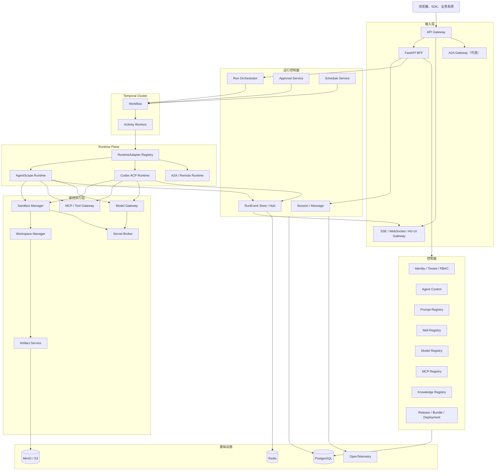

实现时还必须包含以下逻辑组件；它们可以在模块化单体中作为模块存在，但不能省略职责：

- **Model Gateway**：供应商密钥、模型能力、限流、预算、Token/费用和错误归一化。
- **Policy Service**：租户、用户、Agent、工具、数据和运行时策略求交集。
- **Admission Controller**：在创建 Run 和 Sandbox 前执行并发、预算、配额与资源准入。
- **Reconciliation Worker**：修复 Run、Workflow、Event、Outbox、Sandbox 和 Deployment 的不一致。
- **Schema Registry**：维护 RunSpec、RunEvent、Bundle Manifest 和 Skill Manifest 版本兼容关系。

## 5. 推荐工程结构

V1 后端采用模块化单体 API，Runtime Worker、Temporal Worker、Event Worker 和 Sandbox Manager 独立进程部署；业务增长后只有通过 ADR 才拆分新的网络服务。

```text
agent-platform/
├── backend/
│   ├── apps/
│   │   ├── api/                # FastAPI 管理与运行 API
│   │   ├── runtime_worker/     # AgentScope / Codex Runtime Worker
│   │   ├── temporal_worker/    # Temporal Workflow 和 Activity
│   │   └── sandbox_manager/    # Sandbox 控制服务
│   ├── packages/               # 领域、应用、契约和基础设施模块
│   ├── migrations/             # Alembic
│   └── tests/
├── frontend/
│   ├── src/                    # Vue 3 + Vite 前端
│   └── tests/
├── deploy/
│   ├── docker-compose/
│   ├── helm/
│   └── temporal/
└── docs/
```

V1 依赖基线：

```text
FastAPI + Pydantic v2
SQLAlchemy 2 + Alembic
PostgreSQL + Redis
Temporal Python SDK
AgentScope 2.0.x
OpenTelemetry
MinIO / S3 SDK
Vue 3 + Vite + TypeScript
```

### 5.1 Python 工程基线

- CPython 3.12 作为首期运行基线；升级或降级必须通过 AgentScope、Temporal、数据库驱动和 Codex Adapter 兼容性测试。
- 使用 `pyproject.toml + uv.lock` 管理依赖和可复现环境；生产镜像禁止运行时临时解析未锁定依赖。
- Black 作为唯一格式化标准，行宽固定为 88；Ruff 负责静态规则和导入，Pyright strict 负责类型检查。
- pytest 负责单元与集成测试，Testcontainers 或 Docker Compose 提供 PostgreSQL、Redis、Temporal 和对象存储测试环境。
- SQLAlchemy 2.x 使用显式异步 Session；数据库迁移统一使用 Alembic。
- 配置使用 Pydantic Settings 或等价强类型配置，环境变量只传递非敏感配置和 Secret Reference。
- API、Temporal Worker、Runtime Worker、Event Worker 和 Sandbox Manager 是独立进程，不依赖 Python 进程内共享状态。
- `async def` 调用链不得直接执行阻塞 SDK；无异步 SDK 时使用受控线程池、进程池或专用 Worker，并设置超时和并发上限。
- Temporal Workflow 代码不得直接访问网络、数据库、随机数和系统当前时间；所有非确定性操作放入 Activity。
- 公共后端契约集中在 `backend/packages/contracts`，禁止各应用复制并独立修改 Pydantic Model。
- 所有数据库查询通过 Repository/DAO 或明确数据访问层，统一执行 Tenant Scope、审计和事务约束。
- CI 至少执行 Black check、Ruff、类型检查、单元测试、契约测试和 Alembic migration check。

### 5.2 Vue 前端工程基线

- 使用 Vue 3 Composition API、TypeScript 和 `<script setup lang="ts">`，禁止在同一功能中混用多套组件 API 风格。
- 使用 Vite 构建，Vue Router 4 管理路由和权限守卫；history 模式部署必须配置服务端 fallback。
- Pinia 只管理跨页面客户端状态；服务端实体、缓存、重试和失效由 `@tanstack/vue-query` 管理。
- TypeScript API Client 从评审后的 OpenAPI 生成，页面禁止手写重复 DTO；RunEvent Type 从 JSON Schema 生成或由同一源码导出。
- SSE/AG-UI 接入通过独立 service/composable 和可测试状态归并函数实现，组件不得成为运行事件的唯一事实来源。
- 前端 CI 至少执行 Prettier check、ESLint、`vue-tsc --noEmit`、Vitest、Vue Test Utils 组件测试和生产构建；关键流程使用 Playwright。
- 设计 token、主题和组件库通过项目统一入口管理，业务页面不得散落重复颜色、间距、圆角和权限判断。
- UI 组件库固定为 Element Plus，业务页面通过项目封装层使用，禁止直接依赖全局主题内部实现。
- 具体选型和迁移边界以 [ADR-001：前端框架采用 Vue 3](./ADR-001-前端框架采用Vue3.md) 为准。

## 6. 模块职责

| 模块 | 主要职责 | 不负责 |
|---|---|---|
| Agent Control | Agent 草稿、绑定、版本、Snapshot | 直接运行 Agent |
| Release Service | 校验、编译、Bundle、部署、激活、回滚 | 会话消息处理 |
| Run Orchestrator | Run 创建、权限、上下文、路由、状态 | 具体模型或 ACP 协议细节 |
| Runtime Adapter | 调用 AgentScope、Codex 或远端 Runtime | 管理前端资源 |
| Event Service | RunEvent 序号、存储、发布、回放 | 解释 Runtime 原始事件语义 |
| Sandbox Manager | 创建、复用、停止、限制执行环境 | 决定 Agent 业务权限 |
| Workspace Manager | 文件目录、上传、导出、配额和 TTL | 任意执行 Shell |
| Temporal Worker | 持久化任务流程、重试、Signal、Timer | 保存业务主数据 |
| AG-UI Adapter | RunEvent 转换为前端事件 | 作为内部唯一事件模型 |
| Model Gateway | 模型认证、能力、限流、预算、统计、fallback 和错误归一化 | 执行 Agent Loop |
| Policy Service | 汇总平台、租户、Agent、用户和工具策略并做执行前决策 | 信任前端或模型自行声明权限 |
| Admission Controller | 并发、配额、预算和 Sandbox 资源准入 | 代替运行中的超时与取消 |
| Reconciliation Worker | 检测并修复跨系统状态不一致 | 成为新的业务事实来源 |

## 7. 核心领域模型

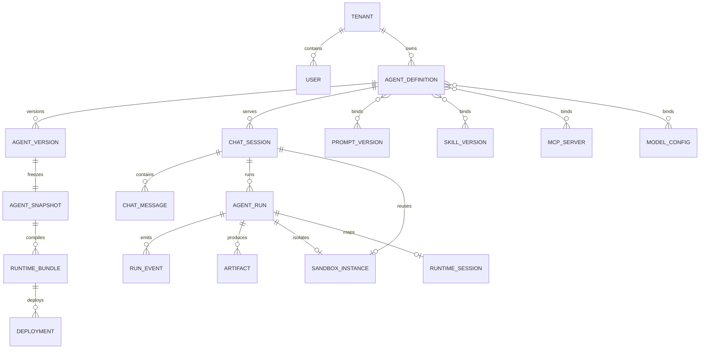

### 7.1 关键事实来源

| 数据 | 唯一事实来源 |
|---|---|
| Agent 可编辑配置 | AgentDefinition 和关系表 |
| 一次发布配置 | AgentSnapshot |
| Runtime 实际文件 | RuntimeBundle + File Manifest |
| 当前激活版本 | Deployment |
| 会话业务历史 | ChatSession / ChatMessage |
| 运行生命周期 | AgentRun |
| 流式和回放 | RunEvent |
| Run 编排生命周期 | Temporal Workflow History + 平台任务映射 |
| 文件内容 | Object Storage，数据库只保存元数据 |

事实来源之间的关系：

- `AgentRun` 是 API 查询和业务统计使用的 Run 当前状态事实。
- Temporal History 是 Run 编排、Signal、Timer 和 Activity 调度事实，不直接承担前端事件查询。
- `RunEvent` 是用户可见运行历史和 SSE 回放事实，不代替 AgentRun 当前状态。
- Runtime Session 和 Sandbox Instance 保存执行映射，但不能独立决定业务终态。
- Reconciliation Worker 定期比较上述事实来源，通过幂等补偿修复；不得直接伪造成功终态。
- 所有事实表、对象路径、缓存 Key、Workflow ID 和内部消息必须携带或可解析出 `tenant_id`。

## 8. 平台契约

## 8.1 RuntimeAdapter

```python
from collections.abc import AsyncIterator
from typing import Protocol


class RuntimeAdapter(Protocol):
    runtime_type: str
    contract_version: str

    async def capabilities(self, target: "RuntimeTarget") -> "RuntimeCapabilities":
        ...

    async def health(self, target: "RuntimeTarget") -> "RuntimeHealth":
        ...

    async def validate_target(self, target: "RuntimeTarget") -> "ValidationResult":
        ...

    async def prepare(self, spec: "RunSpec") -> "PreparedRuntime":
        ...

    async def stream(self, prepared: "PreparedRuntime") -> AsyncIterator["RuntimeEventCandidate"]:
        ...

    async def resume(self, recovery_token: str) -> AsyncIterator["RuntimeEventCandidate"]:
        ...

    async def inspect(self, run_id: str) -> "RuntimeRunStatus":
        ...

    async def cancel(
        self, run_id: str, execution_fencing_token: str
    ) -> "CancellationResult":
        ...

    async def release_session(self, runtime_session_id: str) -> None:
        ...
```

必须提供：

- `AgentScopeRuntimeAdapter`
- `CodexAcpRuntimeAdapter`

不建立 `ModelApiRuntimeAdapter`；模型访问是 AgentScope Runtime 通过 Model Gateway 使用的平台能力，不属于独立 Agent Runtime。

RuntimeAdapter 必须满足统一契约测试，并声明是否支持 Session、恢复、取消、工具调用、文件、Thinking、Plan 和审批。缺失能力在发布校验阶段拒绝，不能运行时静默降级。

## 8.2 RunSpec

```python
class RunSpec(BaseModel):
    spec_version: str
    run_id: str
    trace_id: str
    tenant_id: str
    user_id: str
    session_id: str
    runtime_session_id: str | None
    execution_attempt: int
    execution_fencing_token: str
    idempotency_key: str

    agent_id: str
    agent_snapshot_id: str
    deployment_id: str
    runtime_target: RuntimeTargetSpec

    user_text: str
    attachments: list[AttachmentSpec]
    session_context_ref: ImmutableContentRef | None
    session_context_hash: str | None

    prompt: CompiledPrompt
    model: ModelBinding
    skills: list[SkillBinding]
    tools: list[ToolBinding]
    mcp_servers: list[McpBinding]

    sandbox: SandboxPolicy
    workspace: WorkspaceBinding
    permission: PermissionPolicy

    timeout_seconds: int
    token_budget: int | None
    cost_budget: Money | None
```

RunSpec 约束：

- 使用规范化 JSON 计算 Hash，并保存 `spec_version`、Compiler Version 和 Hash。
- 大型 Prompt、附件、Bundle 和 Session Context 优先使用不可变引用与内容 Hash，不在内部消息中无限复制。
- 不包含长期 Secret 明文；Runtime 通过短期交换票据向 Secret Broker 或 Model Gateway 获取能力。
- `execution_fencing_token` 每次执行尝试更新，旧 Worker 的状态和事件写入必须被拒绝。
- 每个字段定义大小上限，整个 RunSpec 默认不得超过内部消息系统的安全限制。

## 8.3 RunEvent

```python
class RunEvent(BaseModel):
    schema_version: str
    event_id: str
    source_event_id: str
    tenant_id: str
    run_id: str
    session_id: str
    sequence_no: int
    event_type: str
    occurred_at: datetime
    recorded_at: datetime
    payload_version: str
    payload: RunEventPayload
    trace_id: str
    execution_attempt: int
```

RuntimeAdapter 不直接构造上述 RunEvent，而是输出不含 `event_id`、`sequence_no` 和 `recorded_at` 的 `RuntimeEventCandidate`。Event Service 完成幂等校验、fencing 校验、序号分配和持久化后形成 RunEvent。权威 Schema 为 [`schemas/run-event-v1.schema.json`](./schemas/run-event-v1.schema.json)。

标准事件：

```text
run_created
run_queued
run_started
text_message_start
text_delta
text_message_end
thinking_delta
plan_updated
tool_call_start
tool_call_args
tool_call_result
approval_required
approval_resolved
task_progress
artifact_created
warning
run_succeeded
run_failed
run_cancelled
run_timeout
```

### 事件约束

- `sequence_no` 在同一 Run 内严格单调递增。
- 事件写入使用幂等键 `run_id + execution_attempt + source_event_id`。
- `payload` 需有事件类型对应的 Pydantic Schema，不能长期使用无约束字典。
- Runtime 原始事件可保存到受限 Trace 存储，但不得直接发送前端。
- 终态只能写入一次；重复终态按幂等处理并告警。
- 每种 Payload 都有独立 `payload_version` 和 Pydantic Model，并规定字段级脱敏策略。
- `source_event_id + execution_attempt` 在同一 Run 内唯一。
- fencing token 只用于 Event Service 写入鉴权，不进入持久化 Payload、SSE 或前端响应。
- 事件 Payload 默认不超过 256KB；大内容和文件使用 Artifact 引用。
- `text_delta` 允许按 50～200ms 窗口合并，避免每个 Token 单独写数据库。

## 9. Prompt 编译设计

Prompt 由多个来源确定性编译：

```text
平台系统策略
+ 已发布 Agent Prompt
+ Session 业务上下文
+ Skill 使用说明
+ Runtime 约束
+ Sandbox / Workspace 约束
+ 当前用户输入
```

每次 Run 保存：

- Prompt Template Version。
- 各变量来源和非敏感值。
- 编译结果 Hash。
- Compiler Version。
- Session Context Version。

Secret 和敏感业务数据不保存到可公开的 Prompt Diff。

Prompt Compiler 还必须定义：

- 每一层内容的优先级和不可覆盖边界；用户输入、知识库和工具结果始终视为不可信数据。
- 变量的类型、必填、默认值、最大长度、转义和缺失处理。
- Context Window 分配：系统策略、历史消息、检索内容、Skill、工具结果和用户输入的 Token 配额。
- 超限时的截断、摘要和拒绝策略，禁止无提示地截断关键安全策略。
- Session 历史摘要的版本、来源消息范围和生成模型。
- 不同 Runtime 对 Prompt、Tool Schema 和 Reasoning 参数的能力差异及降级规则。
- 编译产物只保存允许审计的内容；敏感值保存 Hash、来源和脱敏摘要。

## 10. Skill 设计

## 10.1 manifest.yaml 示例

```yaml
apiVersion: agent-platform/v1
kind: Skill
metadata:
  name: data-analysis
  version: 1.2.0
  displayName: 数据分析
runtime:
  compatible:
    - agentscope
    - codex
entry:
  instructions: SKILL.md
permissions:
  filesystem:
    read:
      - workspace://tenant/{tenant_id}/user/{user_id}/session/{session_id}/runs/{run_id}/**
    write:
      - workspace://tenant/{tenant_id}/user/{user_id}/session/{session_id}/runs/{run_id}/output/**
  network:
    allowDomains: []
  tools:
    - python
dependencies:
  python:
    - pandas>=2.2,<3
inputs:
  type: object
  properties:
    question:
      type: string
outputs:
  type: object
  properties:
    artifact_uri:
      type: string
sandbox:
  imageDigest: registry.example/agent-platform/python-data@sha256:<digest>
  timeoutSeconds: 600
```

## 10.2 Skill 发布校验

- 安全名称和版本格式。
- `SKILL.md`、`manifest.yaml` 必须存在。
- 禁止绝对路径和 `..`。
- ZIP 解压防 Zip Slip。
- 软链接不能逃出包根目录。
- 依赖和 Runtime 兼容性校验。
- 权限声明不得超过租户允许的最大策略。
- 在临时 Sandbox 中执行测试用例。
- 生成依赖锁定结果、SBOM、来源信息和内容签名；发布后依赖解析结果不可变。
- Git、ZIP 和本地导入均记录来源 Hash；禁止构建阶段访问生产 Secret。
- 依赖安装使用受控镜像和隔离构建环境，限制网络、CPU、内存、磁盘和时间。
- 多个 Skill 的依赖冲突必须在发布时失败或生成独立环境，禁止运行时污染共享解释器。
- `scripts/` 视为不可信代码，必须经过静态扫描和 Sandbox 冒烟测试。

MCP Server 绑定发布时必须冻结协议、Endpoint 标识、工具 Schema Hash、授权工具集合和 Secret Reference。远端 MCP 返回内容视为不可信数据；STDIO MCP 必须在 Sandbox 内启动，不能由 API 进程直接执行任意命令。

## 11. Runtime Bundle

平台先生成统一 Snapshot，再按 Runtime 编译。

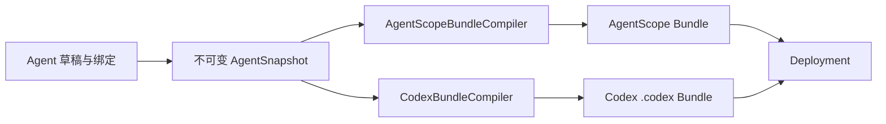

### 11.1 AgentScope Bundle

```text
bundle/
├── manifest.json
├── runtime.yaml
├── prompt/
│   └── system.md
├── skills/
├── tools/
├── mcp/
├── schemas/
└── file-manifest.json
```

### 11.2 Codex Bundle

```text
bundle/
├── manifest.json
├── .codex/
│   ├── AGENTS.md
│   ├── config.toml
│   ├── agents/
│   │   └── <sub-agent>.toml
│   └── skills/
│       └── <skill>/
│           ├── SKILL.md
│           ├── manifest.yaml
│           └── ...
└── file-manifest.json
```

Bundle 中模型和 MCP 凭据只保存 Secret Reference。真正值由 Secret Broker 在 Sandbox 启动时注入。

### 11.3 Bundle 文件策略

- 生产模式下 Bundle 整体平台托管，构建完成后原子替换。
- 开发模式若允许人工编辑，平台托管区使用明确 BEGIN/END 标记并进行脏文件检测。
- `agents/` 和 `skills/` 每次基于 Snapshot 全量重建，解绑后必须删除旧文件。
- 每个文件保存路径、Hash、大小、来源实体和生成器版本。

## 12. Agent 发布流程

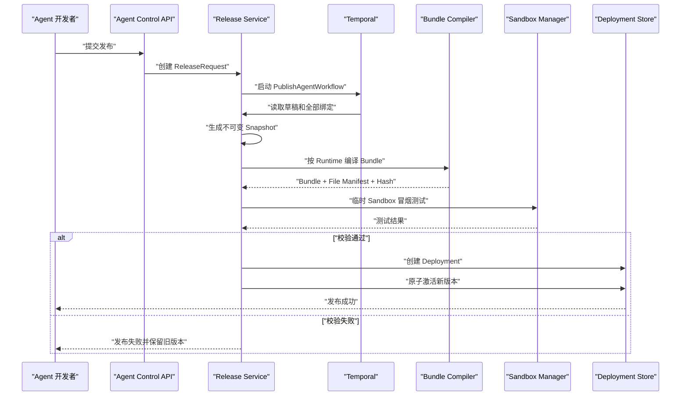

### 12.1 PublishAgentWorkflow

固定基础 Activities：

```text
validate_release_request
load_agent_graph
create_snapshot
compile_runtime_bundle
scan_bundle_security
provision_smoke_sandbox
run_smoke_test
store_bundle
activate_deployment
emit_audit_event
```

每个 Activity 使用确定性输入和幂等键；失败重试不能重复创建多个有效 Deployment。

## 13. Run 创建流程

无论 Runtime 类型如何，平台统一先落库后执行。

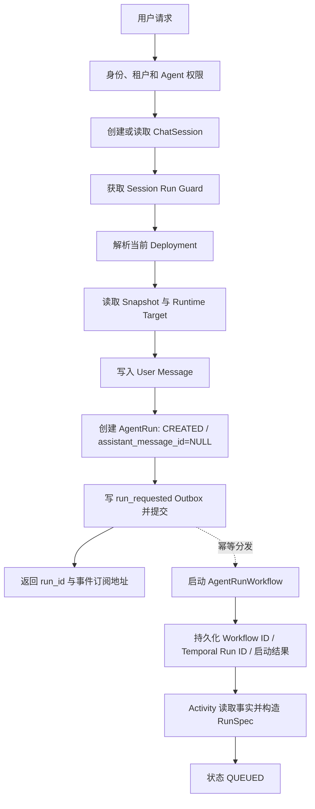

Session Run Guard 默认限制同一 Session 同时只有一个主 Run；需要并发时通过消息分支创建新的逻辑 Session 或 Branch。

## 14. AgentScope 运行流程

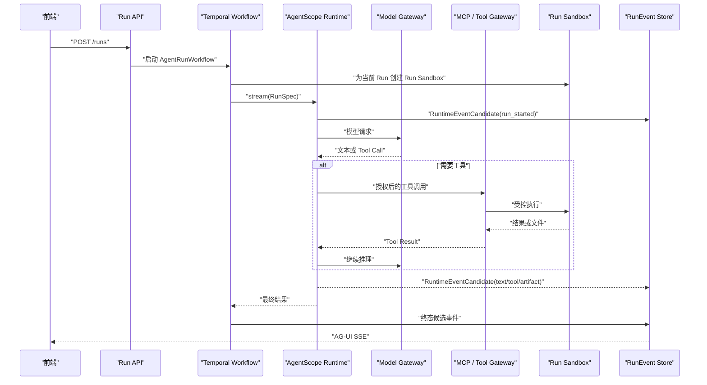

### 14.1 AgentScope 适配职责

- 按 Snapshot 创建 Agent、Model、Toolkit 和 Memory。
- 将 AgentScope 事件转换为 `RuntimeEventCandidate`；由 Event Service 分配序号并生成、持久化 RunEvent。
- 不直接写数据库业务表。
- 不直接读取 Secret 明文存储。
- 通过 Tool Gateway 调用平台 MCP 和业务工具。
- 通过 Sandbox API 执行代码和文件操作。
- 收到取消时调用 Agent 中断并释放运行句柄。

## 15. Codex ACP 运行流程

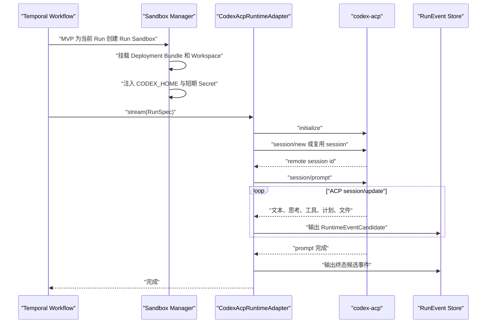

### 15.1 Codex Session 映射

平台保存：

```text
platform_session_id
runtime_type
runtime_target_id
runtime_session_id
deployment_id
sandbox_instance_id
last_used_at
status
```

以下情况必须重建 Codex Session：

- Deployment 或 Snapshot 变化。
- Runtime Target 变化。
- Sandbox 已回收。
- Bundle Hash 变化。
- 用户或租户隔离主体变化。
- Runtime Session 被 Codex 判定不可恢复。

### 15.2 Codex 取消

```text
用户取消
→ Temporal Signal cancel
→ CodexAcpRuntimeAdapter.cancel
→ ACP session/cancel
→ 等待宽限时间
→ 必要时终止 STDIO 子进程或 Sandbox
→ 写 run_cancelled
```

取消操作必须幂等；已经进入终态的 Run 返回当前终态，不重复改变状态。

## 16. Sandbox 生命周期

### 16.1 Run Sandbox（MVP 默认）

适用于所有 MVP Agent 和敏感任务：

```text
每个 Run 独立创建
→ 只挂载本次只读 Bundle 和必要输入
→ 注入最小权限短期能力
→ 执行并持续采集资源状态
→ 导出白名单 Artifact
→ 清理进程和挂载
→ 立即销毁
```

### 16.2 Session Sandbox（V1 受控能力）

仅适用于经过隔离测试、无高风险生产写能力的 Agent：

```text
首次 Run
→ 创建 Session Sandbox
→ 挂载只读 Bundle
→ 创建可写 Workspace
→ 多个串行 Run 复用
→ 每次 Run 前执行权限和进程检查
→ 空闲或最大存活时间到期
→ 归档 Artifact
→ 销毁
```

Session Sandbox 复用键至少包含 `tenant_id + user_id + session_id + deployment_id + bundle_hash + permission_policy_hash + sandbox_policy_hash`。任一字段变化、残留进程无法清理、Workspace 完整性失败或 Sandbox 超过最大存活时间时必须重建。

### 16.3 Sandbox Policy

```python
class SandboxPolicy(BaseModel):
    scope: Literal["session", "run"]
    image: str
    cpu_limit: float
    memory_mb: int
    disk_mb: int
    pids_limit: int
    timeout_seconds: int
    run_as_non_root: bool = True
    network_mode: Literal["none", "allowlist"] = "none"
    allowed_domains: list[str] = Field(default_factory=list)
    allowed_commands: list[str] = Field(default_factory=list)
    readonly_mounts: list[str] = Field(default_factory=list)
    writable_mounts: list[str] = Field(default_factory=list)
```

### 16.4 安全要求

- Sandbox Manager 独立服务，不向 API 容器暴露宿主 Docker Socket。
- Sandbox 内不得直接连接平台主库。
- Secret 使用短期凭据或一次性 Token。
- 对 DNS、HTTP 重定向和私网 IP 进行 SSRF 防护。
- 禁止特权容器、Host Network 和任意 HostPath。
- 生产推荐 Kubernetes Job + gVisor/Kata 或等价隔离方案。
- 镜像使用不可变 Digest，并保存签名、SBOM 和漏洞扫描结果。
- 应用 seccomp、AppArmor/SELinux、只读根文件系统、capability drop 和独立 ServiceAccount。
- 网络白名单由 egress proxy 或等价控制执行，不能只依赖应用层域名检查。
- `allowed_commands` 不能只按命令字符串判断，还要限制参数、路径、环境变量和 Shell 解释方式。
- Secret 优先通过短期代理票据或文件描述符提供，避免长期环境变量被子进程读取。
- Sandbox Manager 必须验证调用方服务身份、租户、策略 Hash 和一次性 provision token。

## 17. Workspace 与 Artifact

逻辑路径：

```text
workspace://tenant/{tenant_id}/user/{user_id}/session/{session_id}/
├── input/
├── work/
├── output/
└── runs/{run_id}/
```

物理存储不暴露给模型和前端，统一通过 Workspace URI 访问。

### Artifact 生成流程

```text
Sandbox 创建文件
→ Workspace Watcher 或工具显式上报
→ 校验路径、大小、类型和病毒扫描
→ 上传对象存储
→ 创建 Artifact 元数据
→ 生成 artifact_created RunEvent
→ 前端获得有权限和时效的下载 URL
```

## 18. Temporal 工作流设计

所有 Run 都创建 `AgentRunWorkflow`，以统一取消、审批、超时、重试和故障恢复。Workflow 只记录关键生命周期、Activity 结果、Signal 和 Timer；文本 Delta、Token、普通工具进度和高频 Sandbox 指标直接进入 Event Service，不写入 Temporal History。

## 18.1 Workflow 清单

| Workflow | 用途 |
|---|---|
| PublishAgentWorkflow | Snapshot、Bundle、冒烟测试和发布 |
| AgentRunWorkflow | AgentScope/Codex Run 生命周期 |
| OfflineTaskWorkflow | SQL、文件转换、批处理等离线任务 |
| ScheduledAgentWorkflow | 定时触发 Agent |
| SandboxCleanupWorkflow | 空闲 Sandbox 回收和 Workspace 归档 |
| KnowledgeIngestionWorkflow | 文档解析、分块和索引 |

## 18.2 AgentRunWorkflow 状态

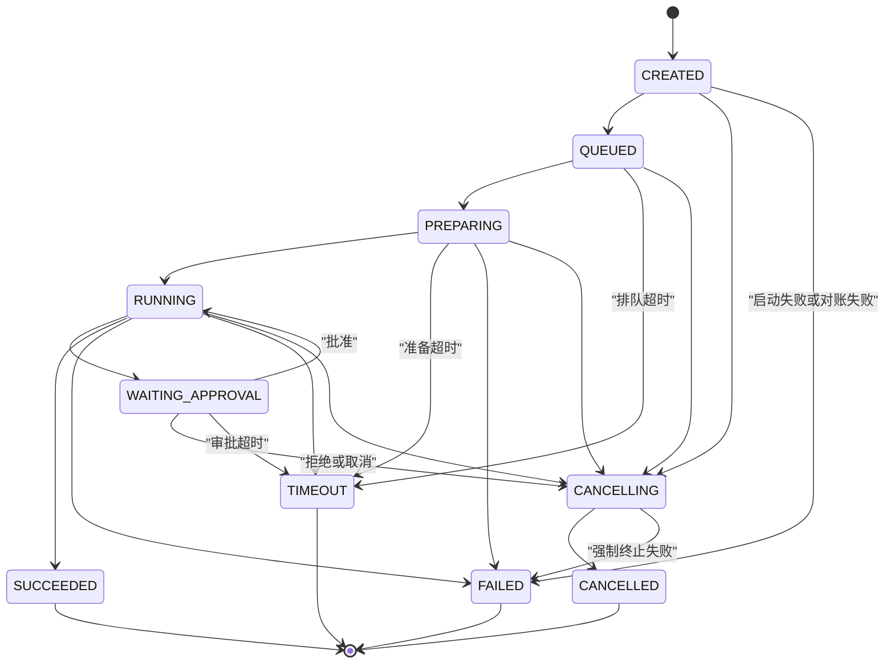

### Signal

- `cancel_run`
- `approval_decided`
- `external_task_completed`
- `extend_timeout`

### Query

- 当前 Run 状态。
- 当前 Activity。
- 当前 Runtime Session。
- 当前 Sandbox Instance。
- 最近事件序号。

### Retry 原则

- 模型请求可按错误类型有限重试。
- 工具写操作默认不自动重试，除非工具声明幂等键。
- 创建 Artifact、写 RunEvent、更新状态必须幂等。
- Codex `session/prompt` 是否重试要结合远端 Session 状态，禁止盲目重复提交用户指令。
- 长 Activity 必须设置 Start-To-Close、Heartbeat Timeout，并在 heartbeat detail 中保存可恢复进度或句柄。
- Workflow 代码升级使用版本标记并执行 Replay Test；长历史按阈值 Continue-As-New。
- Runtime Worker 重启后只有在确认原执行失效并获得新 fencing token 后才能接管。
- Temporal Search Attributes 只保存查询字段，不保存 Prompt、文件内容和高基数敏感数据。

## 19. 审批流程

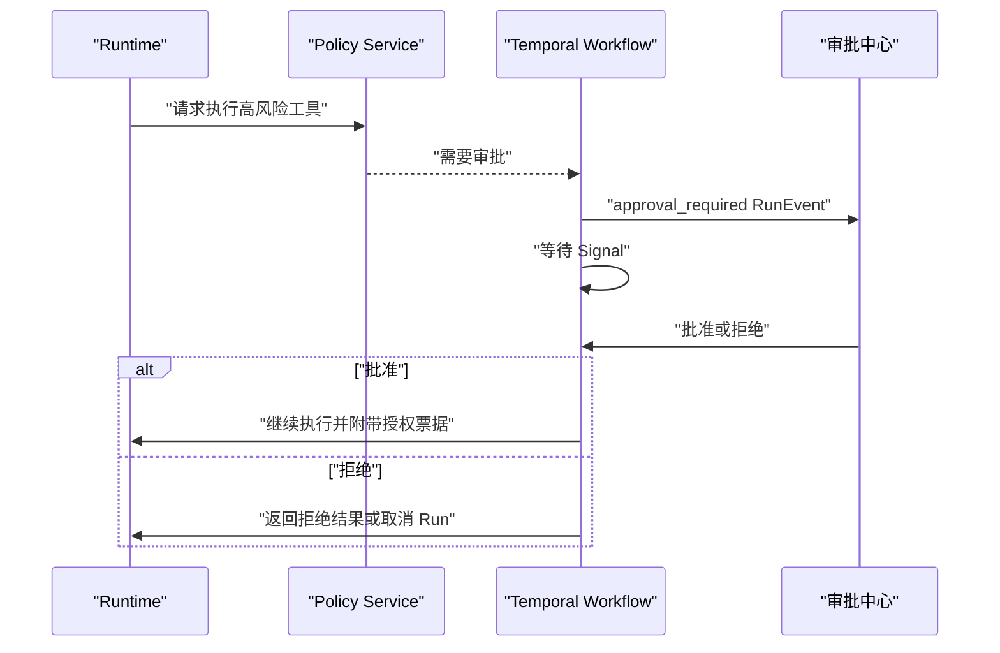

授权票据必须绑定租户、用户、Run、工具、参数摘要、有效期和一次性使用标识。

补充规则：

- 默认禁止申请人审批自己的生产写操作；多级审批策略由租户配置。
- 参数、Deployment、用户权限或 Policy Version 变化后，原票据立即失效。
- 审批具有过期时间；过期后按策略让工具失败或取消 Run，不允许无限等待。
- Approval 决策 API 必须幂等，重复决策返回第一次生效结果。
- 等待期间超过 Sandbox 保留阈值时释放 Sandbox；批准后使用同一 Snapshot 和新的执行票据恢复。

## 20. RunEvent 到 AG-UI

内部 RunEvent 与前端 AG-UI 分开：

| RunEvent | AG-UI 输出 |
|---|---|
| run_started | RUN_STARTED |
| text_message_start | TEXT_MESSAGE_START |
| text_delta | TEXT_MESSAGE_CONTENT |
| text_message_end | TEXT_MESSAGE_END |
| tool_call_start | TOOL_CALL_START |
| tool_call_args | TOOL_CALL_ARGS |
| tool_call_result | TOOL_CALL_RESULT |
| plan_updated | CUSTOM `plan_update` |
| approval_required | CUSTOM `approval_required` |
| artifact_created | CUSTOM `artifact_created` |
| warning | CUSTOM `warning` |
| run_succeeded | RUN_FINISHED |
| run_failed | RUN_ERROR |
| run_cancelled | CUSTOM `run_cancelled` 后输出 RUN_FINISHED |
| run_timeout | RUN_ERROR，错误码 `RUN_TIMEOUT` |

AG-UI Adapter 必须是无状态或可由数据库重建，不能拥有 Run 生命周期的唯一内存状态。

## 21. 事件订阅与回放

```text
GET /api/v1/runs/{run_id}/events?after={sequence_no}
GET /api/v1/runs/{run_id}/stream
```

SSE 规则：

- SSE `id` 使用 `sequence_no`。
- 客户端使用 `Last-Event-ID` 续传。
- 先查询并发送缺失历史，再订阅实时事件。
- 历史与实时切换期间通过序号去重。
- Redis 只负责通知，PostgreSQL RunEvent 才是回放事实来源。
- SSE 建立连接和每次续传都重新校验 tenant、user、run 权限。
- 服务端设置每连接缓冲上限；慢消费者超过上限后断开并要求按序号重连。
- 心跳事件不进入持久化 RunEvent；终态发送后服务端关闭流。
- 文本 Delta 可在不改变语义的前提下合并，客户端只能依赖序号，不能依赖 Token 粒度。

## 22. API 边界

### 22.1 控制面 API

```text
/api/v1/agents
/api/v1/agents/{id}/versions
/api/v1/agents/{id}/publish
/api/v1/prompts
/api/v1/skills
/api/v1/mcp-servers
/api/v1/model-providers
/api/v1/model-configs
/api/v1/knowledge-bases
/api/v1/runtime-targets
/api/v1/sandbox-profiles
/api/v1/deployments
```

### 22.2 运行面 API

```text
POST /api/v1/sessions
GET  /api/v1/sessions/{id}/messages
POST /api/v1/runs
GET  /api/v1/runs/{id}
GET  /api/v1/runs/{id}/events
GET  /api/v1/runs/{id}/events/stream
POST /api/v1/runs/{id}/cancel
POST /api/v1/runs/{id}/retry
POST /api/v1/approvals/{id}/decision
GET  /api/v1/artifacts/{id}/download
```

### 22.3 Runtime 内部 API

Runtime Worker 与平台可使用消息队列或内部 gRPC/HTTP，契约仍以 RunSpec 和 RunEvent 为核心。内部接口必须进行服务身份认证，不得只依赖内网可信。

所有接口的请求、响应、错误码、幂等和版本规则以[Agent平台核心接口与事件契约](./Agent平台核心接口与事件契约.md)为准。本节只定义模块边界，不作为可直接生成代码的完整 OpenAPI。

## 23. 数据一致性

### 23.1 Run 创建事务

同一数据库事务内完成：

1. 校验 Session。
2. 写 User Message。
3. 创建 `assistant_message_id = NULL` 的 AgentRun，状态 CREATED。
4. 将 Session Cursor 更新到 User Message。
5. 写 Outbox Event。

事务提交后由 Outbox Worker 启动 Temporal Workflow，避免“数据库有 Run 但任务未启动”或相反情况。

Outbox Worker 只有在 Workflow 启动成功或确定性 ID 已存在、且启动映射已经幂等写入 AgentRun 后才标记事件 PUBLISHED。若 Temporal 已启动但映射写入失败，事件保持可重试；Reconciler 使用同一确定性 Workflow ID 恢复，不创建第二个 Workflow。长时间 CANCELLING 只允许重发 Cancel Signal 或报告不一致，不依据对账查询直接写 CANCELLED。

Runtime 返回有效最终结果后，终态 Activity 在独立短事务中 INSERT Assistant Message、一次性绑定 Run 并推进 Cursor；失败、取消或超时且没有有效最终结果时不伪造 Assistant Message。Message 内容和父链在任何阶段都不允许 UPDATE/DELETE。

### 23.2 事件写入

- Runtime Event Adapter 提供 source_event_id。
- Runtime 只能调用 Event Service，不能直接写 RunEvent 表。
- Event Service 校验 tenant、run、execution attempt 和 fencing token 后原子分配 sequence_no。
- 写数据库和 Outbox。
- Outbox 发布 Redis 通知。
- 前端按 sequence_no 获取。
- 同一 Run 的事件写入单点串行化或使用数据库原子计数，禁止多个 Writer 自行推测 sequence_no。
- 文本 Delta 使用短窗口批量提交；终态、审批和工具副作用事件立即持久化。
- Event Store 不可用时 Runtime 必须限量缓冲并施加背压，关键事件超过恢复阈值后 Run 失败，不能静默丢弃。

## 24. 故障与恢复

| 故障 | 处理策略 |
|---|---|
| 浏览器断开 | Run 继续，重连后回放 |
| API 重启 | Temporal 和数据库保留状态 |
| Runtime Worker 崩溃 | Activity 重试或 Workflow 进入可恢复失败 |
| Codex 子进程崩溃 | 记录 Runtime Session 失效；按策略重建，不盲目重复 Prompt |
| Sandbox 丢失 | 标记失效；可恢复任务重新创建并恢复允许的 Workspace |
| Redis 丢消息 | 客户端通过数据库事件序号补齐 |
| 对象存储失败 | Artifact Activity 重试，Run 可进入产物处理中状态 |
| 发布失败 | 不切换 Deployment，继续使用旧版本 |
| 事件持久化失败 | 暂停继续消费或写本地缓冲并告警，不能静默丢失关键事件 |
| Temporal History 接近上限 | Continue-As-New，并保留业务 Run ID 与执行尝试映射 |
| Model Gateway 限流 | Admission 降载或按可重试策略退避，不盲目切换模型 |
| Outbox 长时间积压 | 告警、限制新 Run，并由对账任务重新发布未确认记录 |
| 状态事实不一致 | Reconciliation Worker 按状态优先级和幂等规则修复并写审计 |
| Sandbox 销毁失败 | 隔离实例、撤销短期凭据、阻止复用并触发高优先级告警 |

## 25. 安全设计

### 25.1 信任边界

```text
用户输入、模型输出、Skill 文件、MCP 返回、Codex 输出、上传文件
均视为不可信数据
```

### 25.2 关键控制

- OIDC/OAuth2 登录和短期 Access Token。
- 租户隔离字段强制注入查询条件。
- Secret Broker 与普通配置数据库分离。
- Tool Gateway 执行前重新鉴权，不相信模型声明。
- MCP 工具使用 Agent 授权与用户权限交集。
- Sandbox 网络 egress 白名单。
- Artifact 下载采用短期签名 URL。
- RunEvent 对敏感参数脱敏。
- Prompt、Skill、Bundle 发布执行安全扫描。
- 完整审计发布、回滚、Secret、审批、危险工具和管理员操作。
- 浏览器使用 OIDC Authorization Code + PKCE；Cookie 模式启用 CSRF 防护，禁止将长期 Token 放入 SSE URL。
- 内部服务使用 mTLS 或短期工作负载身份，不能共享静态管理员 Token。
- 对登录、Run 创建、上传、模型和工具调用实施分层限流与异常检测。
- Skill、Bundle、镜像和依赖进入供应链扫描、签名与来源审计。
- Prompt Injection 检测仅作为风险信号，最终权限由 Policy Service 和 Tool Gateway 独立执行。

## 26. 可观测性

统一上下文字段：

```text
trace_id
tenant_id
user_id
agent_id
agent_version_id
deployment_id
session_id
run_id
workflow_id
runtime_type
runtime_session_id
sandbox_instance_id
```

指标：

- Run 数、成功率、取消率、超时率。
- 首事件延迟、首 Token 延迟、完整耗时。
- 模型 Token、费用和错误类型。
- 工具/MCP 调用次数、延迟和失败率。
- Sandbox 创建耗时、资源峰值和回收情况。
- Temporal Workflow 堆积、重试和失败。
- Event Store 写入延迟和 SSE 在线连接数。
- Model Gateway 排队、限流、fallback、Token 估算偏差和预算拒绝次数。
- Outbox 积压、对账修复数量、fencing token 拒绝次数和审批等待时长。

日志和指标字段必须有脱敏与基数预算。`run_id` 等高基数标识用于 Trace/Log 查询，不应直接作为长期聚合指标标签。关键告警必须关联模块负责人和 Runbook。

## 27. 部署拓扑

### 27.1 开发环境

```text
Docker Compose
├── Web
├── FastAPI
├── Runtime Worker
├── Temporal Worker
├── Sandbox Manager
├── PostgreSQL
├── Redis
├── MinIO
├── Temporal Server
└── OpenTelemetry Collector
```

### 27.2 生产环境

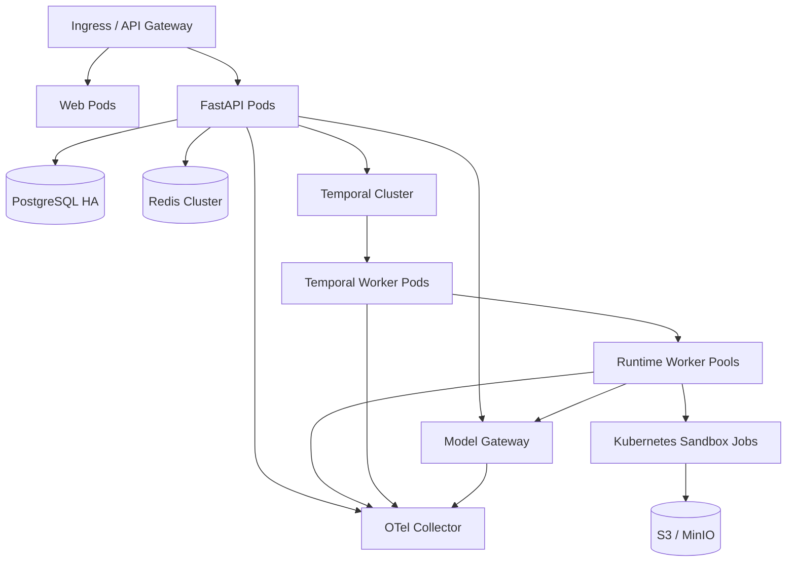

AgentScope 和 Codex Runtime Worker 建议使用独立队列和资源池，避免 Codex 长进程占满普通 AgentScope 任务容量。

## 28. 测试策略

### 28.1 单元测试

- 状态机。
- Prompt Compiler。
- Snapshot Hash。
- Skill Manifest 校验。
- RunEvent 转换。
- AG-UI Adapter。
- 路径和权限规则。
- RuntimeAdapter 错误映射。

### 28.2 契约测试

- RuntimeAdapter Contract Test，一套测试同时跑 AgentScope 和 Codex。
- MCP 协议测试。
- ACP initialize/session/new/session/prompt/cancel 测试。
- AG-UI 输出快照测试。
- Temporal Workflow Replay Test。

### 28.3 集成测试

- 发布到 Run 全链路。
- SSE 断线重连。
- Session Sandbox 复用。
- Run Sandbox 隔离。
- Worker 重启恢复。
- 审批等待和 Signal 恢复。
- Artifact 上传和权限下载。

### 28.4 Vue 前端测试

- Vue Router 权限守卫、Feature Flag 和租户切换。
- Pinia 客户端状态与 `@tanstack/vue-query` 服务端缓存边界。
- RunEvent/SSE 重复、乱序、缺口、重连和终态归并。
- Vue 组件 loading、empty、partial_data、conflict 和 permission_denied 状态。
- OpenAPI Client 与生成 TypeScript 类型编译校验。
- Playwright 覆盖 Agent 创建、发布、对话、取消、断线恢复和审批流程。

### 28.5 安全测试

- Prompt Injection 后尝试越权工具。
- 路径穿越、Zip Slip、软链接逃逸。
- SSRF 和内网探测。
- Secret 泄漏扫描。
- 不同租户 Session、Workspace、Artifact 越权访问。
- Sandbox 资源耗尽和进程逃逸测试。

### 28.6 容量与韧性测试

- 100 个并发 AgentScope Run 与 1,000 个 SSE 连接的基准压测。
- 高频 text_delta 合并、Event Store 批量写入和慢消费者背压。
- PostgreSQL、Redis、Object Storage、Temporal、Model Gateway 降速与短时不可用。
- Runtime Worker、Temporal Worker、Event Worker 和 Sandbox Manager 滚动重启。
- Codex 与 AgentScope Worker Pool 资源隔离和队列饥饿测试。
- 数据库恢复、对象存储恢复和跨组件状态对账演练。

## 29. 开发实施流程

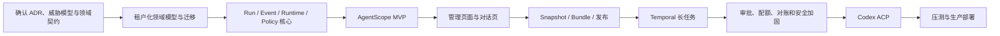

### 29.1 推荐迭代

| 迭代 | 目标 | 退出条件 |
|---|---|---|
| Iteration 0 | 契约和骨架 | RunSpec、RunEvent、RuntimeAdapter、ER、OpenAPI、威胁模型和最小 Temporal Workflow 骨架评审通过 |
| Iteration 1 | AgentScope 可运行 | 所有 Run 经 AgentRunWorkflow，Model Gateway、简单 Tool、SSE、Run Sandbox 成功 |
| Iteration 2 | 控制面可用 | 模型、Prompt、Skill、MCP、Agent 页面完整 |
| Iteration 3 | 发布闭环 | Snapshot、Bundle、Deployment、回滚和 Trace 可用 |
| Iteration 4 | Temporal 可靠性加固 | 长 Run、复杂重试、取消、审批、Continue-As-New 和重启恢复通过 |
| Iteration 5 | Codex ACP | 独立 CODEX_HOME、Skill/MCP、Session、Cancel 通过 |
| Iteration 6 | 企业增强 | Session Sandbox、知识库、评测、A2A 客户端和高级治理通过 |

## 30. ADR 状态

以下通用决策已经由本基线冻结，不再作为普通开发任务的开放问题：

- 模块化单体 API + 独立 Worker/Manager 进程。
- RunEvent 强类型 Schema、Event Service 分配序号和 PostgreSQL 月分区默认方案。
- 所有 Run/发布使用 Temporal；Workflow/Activity/Signal 以专项契约为准。
- MVP Run Sandbox，Session Sandbox 仅为受控 V1 增量。
- Codex V1 只使用 ACP STDIO。
- 共享 PostgreSQL + tenant_id，关键表使用 RLS 防御层。
- Python 3.12、uv lock、Ruff、Pyright strict、SQLAlchemy Async 和 Alembic。
- Vue 3、TypeScript、Vite、Vue Router 4、Pinia、`@tanstack/vue-query`、Element Plus 和 OpenAPI 生成 Client。
- A2A V1 只做客户端，不提供 Server/Gateway。

仍需 ADR 的只有生产部署和精确制品相关事项：真实 OIDC Issuer/Claim、生产 Secret Backend、gVisor 不可用时的等价隔离、供应商费用表、AgentScope 2.0.x 精确 patch/镜像 Digest、Codex/ACP 精确版本以及压测后的容量阈值。默认值和变更规则见[Agent平台工程技术与配置基线](./Agent平台工程技术与配置基线.md)。

## 31. 关键风险

| 风险 | 影响 | 缓解措施 |
|---|---|---|
| 直接把 AgentScope 当完整平台 | 发布、权限、审计和恢复缺失 | 明确控制面和 Runtime 边界 |
| Codex CLI 文本解析 | 版本变化导致协议失效 | 使用 ACP |
| 草稿配置被 Runtime 实时读取 | 历史不可复现 | 只运行 Snapshot 和 Deployment |
| 多 Agent 共用全局 CODEX_HOME | Prompt、Skill、MCP 串用 | 每 Deployment 独立 Bundle 和 Sandbox |
| 只依赖 SSE 保存状态 | 断线或重启丢失 | 事件先持久化，SSE 只传输 |
| Secret 写入 Bundle | 凭据泄漏 | Bundle 仅保存 Secret Reference |
| Temporal Activity 非幂等 | 重试产生重复副作用 | 幂等键、Outbox 和操作票据 |
| Session Sandbox 长期复用 | 状态污染和权限扩大 | TTL、版本变化重建、敏感任务 Run Sandbox |
| Runtime 原始事件直接暴露 | 前端耦合和敏感数据泄漏 | RunEvent 规范化和脱敏 |
| V1 同时建设过多资源域 | 交付周期失控且无生产闭环 | 按 MVP、V1 增量拆分，以纵向场景验收 |
| 多租户隔离延后 | 数据和文件越权，后续改造成本高 | 首日 tenant scope、Repository 约束和隔离测试 |
| Token 级事件逐条写 PostgreSQL | 数据库写放大和存储膨胀 | Delta 合并、批量写、分区和保留策略 |
| Workflow 承载高频流事件 | Temporal History 膨胀和恢复困难 | Workflow 只保存生命周期，流事件进入 Event Service |
| Skill/MCP 任意代码供应链 | 凭证泄漏和 Sandbox 逃逸 | 隔离构建、锁定、SBOM、签名和权限扫描 |
| Session Sandbox 默认复用 | 进程残留、状态污染和权限扩大 | MVP 默认 Run，受控场景再开放 Session |
| Runtime 重试缺少 fencing | 两个 Worker 同时写状态和执行副作用 | execution attempt + fencing token + 对账 |

## 32. 首个纵向 PoC 与 Codex Spike

正式全面开发前，先实现 MVP 纵向切片：

```text
登录
→ 创建模型配置
→ 创建 Prompt
→ 创建带 SKILL.md + manifest.yaml 的 Skill
→ 创建 MCP
→ 创建 Agent
→ 发布 Snapshot 和 Bundle
→ AgentScope 对话
→ Run Sandbox 写文件
→ RunEvent 持久化
→ AG-UI SSE 展示
→ Temporal 长任务
→ 取消、重连、回放和 Artifact 下载
```

MVP PoC 通过标准：

- AgentScope 使用正式 `RunSpec` 与 `RunEvent` 契约，不使用 PoC 专用旁路接口。
- SSE 断开后 Run 继续，重连后无丢失和重复展示。
- API、Runtime Worker 任一重启后长任务可恢复。
- 两个 Session 无法读取彼此 Workspace。
- Snapshot、Bundle 和 Run 能完整追溯。
- 旧 execution fencing token 无法写事件或终态。

并行开展但不阻塞 MVP 产品闭环的 Codex ACP 技术 Spike：

```text
使用同一 Snapshot 编译 Codex Bundle
→ 独立 CODEX_HOME
→ ACP initialize/session/new/session/prompt
→ 文本、工具、文件转换为同一 RunEvent
→ cancel、子进程终止和 Sandbox 销毁
→ Worker 重启后的可恢复性判断
```

Codex Spike 通过标准：

- AgentScope 和 Codex 不修改 Session、Run、RunEvent 核心表即可切换 Adapter。
- Codex 不解析 CLI 展示文本，不使用全局 `~/.codex`。
- 两个 Session 的 Workspace、Prompt、Skill 和 MCP 不串用。
- 无法安全恢复时返回明确错误，不盲目重复用户 Prompt。

通过 MVP PoC 并完成非功能基线后，再扩展 Codex 产品化、Session Sandbox、知识库、A2A、复杂审批和评测能力。
