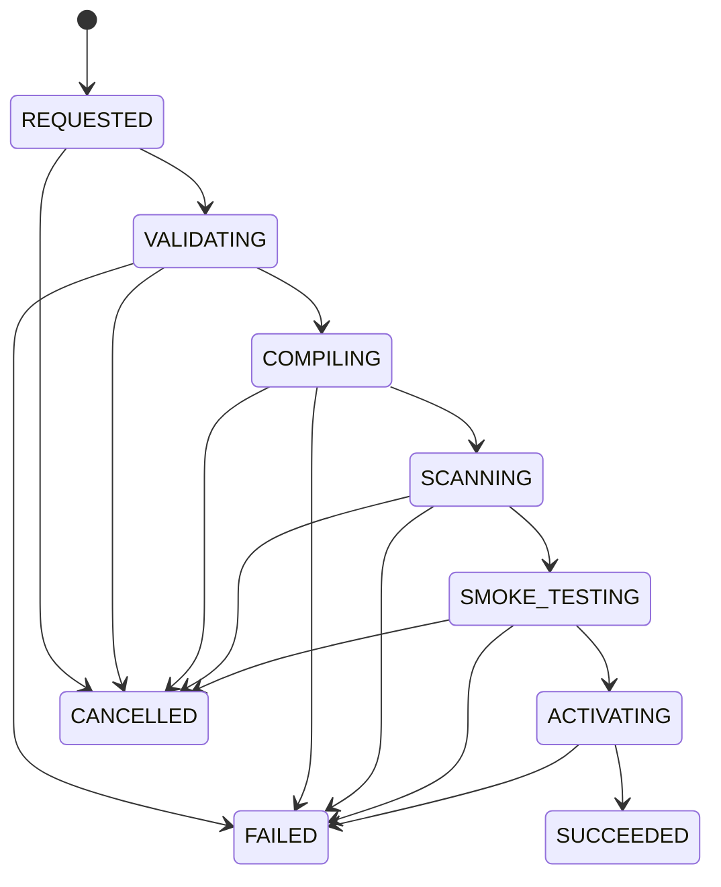
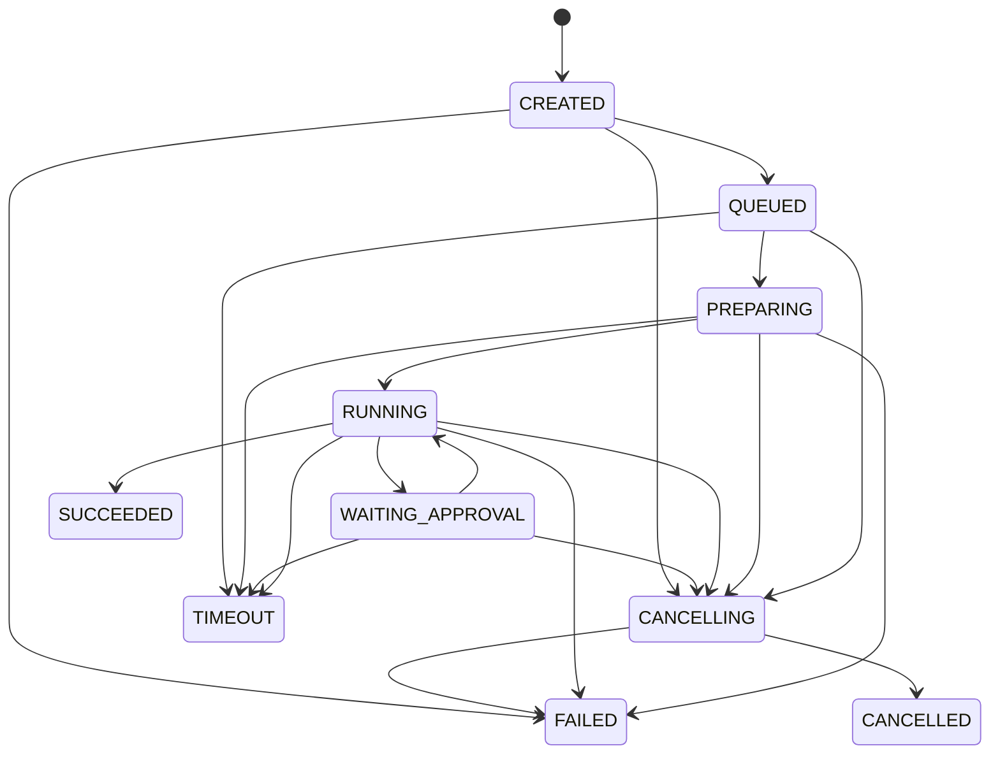

# Agent 平台领域模型与状态机

> 文档版本：V1.8
> 文档状态：开发输入基线  
> 关联需求：[Agent平台需求规格说明书](./Agent平台需求规格说明书.md)  
> 接口契约：[Agent平台核心接口与事件契约](./Agent平台核心接口与事件契约.md)
> 详细字段：[Agent平台数据库详细设计](./Agent平台数据库详细设计.md)

## 1. 设计目标

本文定义数据库建模、唯一约束、租户隔离、聚合边界、状态转换和跨系统一致性规则。字段类型、Null、外键和索引名称以[Agent平台数据库详细设计](./Agent平台数据库详细设计.md)为准，不得由实现自行推断或改变本文语义。

## 2. 全局数据规则

- 所有租户业务表包含 `tenant_id`，唯一约束默认包含 `tenant_id`。
- 所有可编辑资源包含 `resource_version`、`created_at/by`、`updated_at/by`。
- 可审计资源使用软删除或停用；Snapshot、RunEvent、AuditLog 不提供普通更新和删除。
- 所有时间以 UTC 存储。
- JSON 字段必须有对应 Pydantic Schema 和 `schema_version`，不能作为无治理扩展字段长期使用。
- Secret 只保存 `secret_ref`、用途、版本和轮换元数据，不保存明文。
- 数据库外资源保存 URI、Hash、大小和版本；不能仅保存易变化的物理路径。
- 关系表必须明确绑定固定 Version 还是发布时解析的版本策略。

## 3. 聚合与核心实体

### 3.1 身份与权限

| 实体 | 关键字段 | 约束 |
|---|---|---|
| Tenant | id, code, name, status, quota_policy_id | `code` 全局唯一 |
| User | id, external_subject, status | `external_subject` 在身份源内唯一 |
| TenantMember | tenant_id, user_id, status | tenant+user 唯一 |
| Role | tenant_id, code, scope | tenant+code 唯一 |
| RoleBinding | tenant_id, subject_type/id, role_id, resource_scope | 绑定变更写审计 |
| ServiceIdentity | tenant_id, workload, scopes, expires_at | 只使用短期凭据 |

权限判断输入至少包含：

```text
tenant_id + subject + resource_type + resource_id + action
+ resource_owner + environment + policy_context
```

平台 RBAC、租户策略、资源策略、Agent 权限、用户权限和工具风险取交集；任何下游组件不得扩大上游授权。

### 3.2 Agent 发布聚合

| 实体 | 关键字段 | 说明 |
|---|---|---|
| AgentDefinition | id, code, name, owner, status, resource_version | 可编辑入口 |
| AgentBinding | agent_id, resource_type, resource_id, version_policy | Prompt/Skill/MCP/Model 等绑定 |
| AgentVersion | id, agent_id, version_no, created_from_version | 发布版本记录 |
| AgentSnapshot | id, agent_version_id, schema_version, content_hash, content | 不可变完整配置 |
| RuntimeBundle | id, snapshot_id, runtime_type, compiler_version, hash, uri | 不可变 Runtime 产物 |
| Release | id, agent_id, requested_by, status, workflow_id | 发布流程实例 |
| Deployment | id, agent_id, snapshot_id, bundle_id, target_id, status | 可激活运行版本 |

唯一约束：

- `tenant_id + agent.code` 唯一。
- `agent_id + version_no` 唯一。
- `snapshot.content_hash + schema_version` 可用于去重，但不代替业务 ID。
- 同一 `agent_id + runtime_target_id` 最多一个 ACTIVE Deployment。
- Bundle Hash 覆盖文件路径、内容 Hash、权限、编译器版本和 Runtime 类型。

### 3.3 资源注册中心

Prompt、Skill、MCP、ModelConfig、KnowledgeBase、SandboxProfile 采用一致的资源模型：

```text
Definition（可编辑元数据）
→ Version（不可变内容）
→ Status（DRAFT/PUBLISHED/DISABLED）
→ Reference（Agent Binding 或 Snapshot 引用）
```

发布时 Snapshot 固定具体 Version，不保留 `latest` 等动态引用。

### 3.4 会话与运行聚合

| 实体 | 关键字段 | 说明 |
|---|---|---|
| ChatSession | id, user_id, agent_id, title, status, cursor, branch_root_id | 用户会话 |
| ChatMessage | id, session_id, branch_id, parent_message_id, role, content_parts | 不可变消息内容 |
| AgentRun | id, session_id, message_id, snapshot_id, status, current_attempt, workflow_id, temporal_run_id | 业务运行与 Workflow 启动映射事实 |
| RunAttempt | run_id, attempt_no, fencing_token, worker_id, status | 每次实际执行 |
| RuntimeSession | platform_session_id, runtime_type, remote_session_id, compatibility_hash, status | 平台与 Runtime 映射 |
| RunEvent | run_id, sequence_no, source_event_id, payload | 用户可见事件事实 |
| ModelUsage | run_id, model, token, cost, request_id | 模型用量与费用 |

约束：

- 同一 Session 同时最多一个非终态主 Run，可通过部分唯一索引或 Session Guard 实现。
- Retry 创建新的 AgentRun，并通过 `retry_of_run_id` 关联。
- RunAttempt 的 `run_id + attempt_no` 唯一；每次接管生成新的 fencing token。
- `run_id + sequence_no` 唯一。
- `run_id + attempt_no + source_event_id` 唯一。
- ChatMessage 内容不可原地覆盖；编辑或分支产生新 Message。

### 3.5 执行环境与文件

| 实体 | 关键字段 | 说明 |
|---|---|---|
| SandboxInstance | id, scope, image_digest, policy_hash, status, lease_expires_at | 受控执行实例 |
| Workspace | id, tenant/user/session/run, uri, quota, status | 逻辑工作区 |
| Artifact | id, workspace_id, run_id, uri, hash, size, content_type, status | 可下载产物 |
| SandboxLease | sandbox_id, holder_run_id, fencing_token, expires_at | 防止重复占用 |

Session Sandbox 的 `compatibility_hash` 至少由以下内容计算：

```text
tenant + user + session + deployment + bundle
+ permission policy + sandbox policy + runtime target
```

Hash 变化时禁止复用。

### 3.6 审批、审计与可靠消息

| 实体 | 关键字段 | 说明 |
|---|---|---|
| ApprovalRequest | id, run_id, tool, parameter_digest, policy_version, status | 审批业务事实 |
| ApprovalDecision | approval_id, actor, decision, comment | 不可变决策记录 |
| ExecutionTicket | approval_id, nonce, expires_at, consumed_at | 单次工具执行授权 |
| AuditLog | actor, tenant, resource, action, result, diff_digest | 不可变审计事实 |
| IdempotencyRecord | scope, key, request_hash, status, response_ref | API 幂等 |
| OutboxEvent | aggregate, event_type, payload, status, attempts | 事务消息 |
| InboxRecord | consumer, message_id, status | 消费幂等 |

### 3.7 配额与预算

| 实体 | 关键字段 | 说明 |
|---|---|---|
| QuotaPolicy | tenant, status, current_version, resource_version | 租户 Run 准入策略；每租户最多一个 |
| QuotaPolicyVersion | tenant/user/agent/runtime Run concurrency, content_hash | 不可变并发限制版本 |
| BudgetPolicy | tenant, status, current_version, resource_version | 租户周期模型预算；每租户最多一个 |
| BudgetPolicyVersion | UTC period, HARD token_limit, price version | 不可变预算版本；C1 费用字段为空 |
| StoragePolicy | tenant, status, current_version, resource_version | 租户 Workspace/Artifact 存储配额；每租户最多一个 |
| StoragePolicyVersion | Workspace/Artifact bytes/count, content_hash | 四维分离硬限制的不可变版本 |
| BudgetReservation | run_id, policy/version/period snapshot, token/cost reserve, counter evidence, status | Run 与租户周期共用的并发预算预占 |
| PriceCatalogVersion | provider, model, currency, effective time, source/hash | 不可变可信计价版本；具体供应商价格由受控发布提供 |
| PriceCatalogRate | dimension, unit_tokens, unit_price | 版本内 Token 计价维度 |
| CostLedgerEntry | reservation, entry_type, amount/currency, frozen scope/hash | append-only 费用预留、释放、结算和未知事实 |
| ModelProviderAttempt | request attempt, provider/model, submission state | submitted/unknown Provider 尝试的不可变幂等事实 |
| RunCapacityDomain | runtime_target_id, slots, status, config_hash | 全局执行容量域；只由平台 Scheduler 管理 |
| RunCapacityLease | domain, tenant, run, expires/released | 不可超配的 Run 执行槽事实 |
| ArtifactLegalHold | artifact, case_ref, placed/released | 可并存的受审计保留例外 |

硬预算超限阻止新调用；软预算超限产生告警。取消和失败后释放未消费预占，已产生费用不回退。

QuotaPolicy 创建即 ACTIVE；配置更新创建新 Version 并原子切换 `current_version`；`ACTIVE <-> DISABLED` 使用 ETag/CAS。租户版本只能收紧部署硬上限，Run 创建和重试在同一 PostgreSQL 事务读取有效版本、获取 advisory lock、计数并写入事实。

BudgetPolicy 创建即 ACTIVE，支持 UTC 日历 `DAILY/MONTHLY`、`HARD/SOFT`、`token_limit` 与可选 USD/CNY `cost_limit`；更新生成不可变 Version，禁用后 Model Gateway 回退到 Run 自带预算。Gateway 在同一事务按稳定顺序获取 Run、策略周期和币种锁，Token 余额取 Run/租户更严格值；费用上界由冻结 Route cap、Counter 版本/Hash、billing semantics 和 PUBLISHED PriceCatalog 计算，fallback 取最大 Route 上界。HARD 在提交前拒绝，SOFT 放行并幂等写 Outbox/Audit；任一可信事实缺失或币种不一致均失败关闭。

StoragePolicy 创建即 ACTIVE，更新生成不可变 Version；Workspace/Artifact 额度池不互相借用。新建资源读取 ACTIVE Version 并与部署值逐维取最小值，DISABLED 回退部署值。Workspace 以 Run 的冻结 `quota_bytes` 预留，已有 Workspace 不因后续版本变化而修改；两类资源只有进入 `DELETED` 才从租户预留统计释放。

C2a 的调用后费用归因继续保留：Provider 明确返回的金额作为供应商事实；否则只允许使用调用完成时有效的不可变 PriceCatalog 和完整 Token 维度以 Decimal 计算。C2b 在调用前固化 canonical input hash、Counter profile 和各 Route 上界，并以 append-only ledger 记录 RESERVE/RELEASE/SETTLE/ADJUST/UNKNOWN。受控内存目录发布仅供 local/test；生产仍需官方 Counter Golden、durable PriceCatalog 管理入口以及 Planner/Attempt Store 组合。

Artifact retention 状态规则：AVAILABLE 使用 Artifact 创建时一次固化的 `expires_at`（默认 30 天）；FAILED、REJECTED、EXPIRED 进入时一次生成 `retention_delete_after`（默认 7 天）。无活动 Legal Hold 且对应 deadline 到期才允许进入 DELETING。Hold 解除不改变 deadline；删除失败按 1 小时/最多 3 个 Operation 进入可审计恢复。

Capacity Lease 状态规则：WAITING Run 无 Lease；准入时原子创建活动 Lease。Run 未终态时，过期 Lease 只能续租或将调度失败关闭；Run 终态或 Lease 孤儿时才填写 `released_at/release_reason`。Domain `DRAINING/DISABLED` 不再准入新 Lease。

### 3.8 知识库与评测

| 实体 | 关键字段 | 说明 |
|---|---|---|
| KnowledgeDocument | source, version, acl, status | 原始文档 |
| KnowledgeChunk | document_id, chunk_version, content_hash, acl | 分块事实 |
| KnowledgeIndexRecord | chunk_id, embedding_version, index_ref, status | 索引映射 |
| EvaluationSet | agent_id, version, visibility | 评测集 |
| EvaluationCase | set_id, input, assertions, expected_artifacts | 评测样本 |
| EvaluationRun | snapshot_id, model_binding, judge_version, result | 评测执行 |
| UserFeedback | run_id, rating, labels, comment | 用户反馈 |

## 4. 状态机

状态更新必须使用 Compare-And-Set 或等价条件更新。非法转换返回 409，不通过直接赋值绕过状态机。

### 4.1 AgentDefinition

```text
DRAFT -> ACTIVE
ACTIVE -> DISABLED
DISABLED -> ACTIVE
DRAFT/ACTIVE/DISABLED -> DELETING -> DELETED
```

- ACTIVE 表示允许编辑和发布，不代表已有可用 Deployment。
- DELETED 后历史 Version/Snapshot/Run 仍可追溯。

### 4.2 Release



- 任何失败不影响当前 ACTIVE Deployment。
- ACTIVATING 使用数据库事务或带 fencing 的原子切换。
- 回滚创建新 Release，不把旧 Release 状态改回成功。

### 4.3 Deployment

```text
STAGED -> ACTIVE -> RETIRED
STAGED -> FAILED
ACTIVE -> DEGRADED -> ACTIVE/RETIRED
```

同一 Agent 和 Runtime Target 最多一个 ACTIVE。正在运行的 Run 固定原 Deployment，不因切换而变化。

### 4.4 AgentRun



终态：`SUCCEEDED`、`FAILED`、`CANCELLED`、`TIMEOUT`。

规则：

- 终态不可变。
- `SUCCEEDED_WITH_WARNINGS` 是结果属性，不新增业务终态。
- Cancel Request 先进入 CANCELLING；只有 Runtime 停止或强制终止确认后进入 CANCELLED。
- 超时与取消竞态以首次成功写入的终态为准，并记录冲突告警。
- 新执行尝试必须更新 current_attempt 和 fencing token。
- Outbox 启动成功或命中已存在 Workflow 后，必须先幂等持久化 Workflow ID、Temporal Run ID 和启动结果，再确认 Outbox；不同 Workflow 不得覆盖同一 Run。
- 长时间 CREATED/CANCELLING 由 Reconciler 对比 Temporal：缺失时恢复启动意图，存在时补映射或重发取消；不得仅因 Workflow 查询结果直接伪造 Run 终态。

### 4.5 RunAttempt

```text
ALLOCATED -> STARTING -> RUNNING -> COMPLETED
ALLOCATED/STARTING/RUNNING -> LOST
ALLOCATED/STARTING/RUNNING -> CANCELLED
```

LOST 后是否新建 Attempt 由 Workflow 根据 Runtime 恢复能力和副作用状态决定。未知提交状态禁止自动重复用户 Prompt 或写工具。

### 4.6 RuntimeSession

```text
CREATING -> ACTIVE -> STALE -> RELEASING -> RELEASED
CREATING/ACTIVE -> FAILED
```

Deployment、Bundle、权限、Sandbox 或 Runtime Target 兼容 Hash 变化后标记 STALE，不再接受新 Run。

### 4.7 SandboxInstance

```text
REQUESTED -> PROVISIONING -> READY -> IN_USE
IN_USE -> READY: Session Sandbox 释放 Lease
IN_USE -> TERMINATING: Run Sandbox 完成
READY -> TERMINATING: TTL/策略变化
REQUESTED/PROVISIONING -> FAILED
IN_USE -> QUARANTINED: 清理或安全检查失败
QUARANTINED -> TERMINATING
TERMINATING -> TERMINATED
```

- QUARANTINED 实例禁止复用，立即撤销 Secret 和网络能力。
- Sandbox Manager 崩溃后由 Reconciler 根据实际执行环境恢复状态。

### 4.8 ApprovalRequest

```text
PENDING -> APPROVED
PENDING -> REJECTED
PENDING -> EXPIRED
PENDING -> CANCELLED
APPROVED -> CONSUMED
APPROVED -> EXPIRED
```

Approval Decision 不可修改。参数摘要或策略版本变化后创建新 Approval。

### 4.9 Artifact

```text
UPLOADING -> SCANNING -> AVAILABLE -> EXPIRED
UPLOADING -> FAILED
SCANNING -> REJECTED
SCANNING -> FAILED
AVAILABLE -> DELETING -> DELETED
```

AVAILABLE 前不能生成普通下载 URL。REJECTED 文件进入隔离区并受更严格访问控制。

### 4.10 OutboxEvent

```text
PENDING -> PUBLISHING -> PUBLISHED
PUBLISHING -> PENDING: 可重试失败
PENDING/PUBLISHING -> DEAD: 超过最大次数
```

DEAD 必须告警并提供人工或自动重放，重放仍使用原消息 ID。

### 4.11 KnowledgeDocument

```text
UPLOADED -> PARSING -> INDEXING -> READY
UPLOADED/PARSING/INDEXING -> FAILED
READY -> REINDEXING -> READY
READY -> DELETING -> DELETED
```

删除完成前检索层必须通过版本或 ACL 标记排除已删除文档，后台继续清理 Chunk 和向量。

## 5. 事务边界

### 5.1 创建 Run

同一 PostgreSQL 事务完成：

1. 锁定或条件更新 Session Cursor。
2. 校验无活动主 Run。
3. 写 User Message。
4. 创建 `assistant_message_id = NULL` 的 AgentRun CREATED。
5. 将 Session Cursor 指向 User Message。
6. 创建 Outbox `run_requested`。
7. 写必要审计信息。

事务外不得先启动 Temporal。Outbox Worker 使用确定 Workflow ID 幂等启动。

### 5.2 发布激活

编译、扫描、冒烟测试在事务外完成。激活事务内：

1. 校验 Release、Snapshot、Bundle 和 Target 状态。
2. 将原 ACTIVE Deployment 设为 RETIRED。
3. 将新 Deployment 设为 ACTIVE。
4. 写 Deployment 变更 Outbox 和 AuditLog。

### 5.3 事件与 Run 状态

- Event Service 在单事务中分配 sequence、写 RunEvent 和 Event Outbox。
- 终态事件写入时条件更新 AgentRun；冲突终态拒绝并告警。
- 普通 Delta 不同步更新 AgentRun，避免热点行写放大。
- Assistant Message 只在 Runtime Final Result 通过契约校验后由终态处理器 INSERT；同事务将 Run 的 `assistant_message_id` 从 NULL 一次性绑定到该消息并推进 Session Cursor。
- Message 始终只增不改；不得通过占位、流式拼接或终态回填 UPDATE 已有 Message。无有效最终结果的失败、取消或超时 Run 可以不产生 Assistant Message。

## 6. 跨系统一致性与对账

必须实现以下 Reconciliation：

| 对账 | 触发条件 | 修复 |
|---|---|---|
| Run vs Workflow | CREATED/QUEUED 长时间无 Workflow | 幂等启动或标记失败 |
| Workflow vs Run | Workflow 终态但 Run 非终态 | 校验后补终态和事件 |
| Run vs Event | Run 终态但无终态事件 | 补标准终态事件 |
| Sandbox vs Run | Sandbox IN_USE 但 Run 已终态 | 撤销 Lease 并销毁/清理 |
| RuntimeSession vs Sandbox | Session 指向已销毁 Sandbox | 标记 STALE |
| Outbox | PENDING 超时或 DEAD | 告警并幂等重放 |
| Deployment | 多个 ACTIVE 或无有效 ACTIVE | fencing 修复并告警 |
| Artifact | 元数据与对象存储不一致 | 重试、标记失败或隔离孤儿对象 |
| Knowledge | 文档状态与索引不一致 | 重建或清理索引 |

对账任务的所有修复写 AuditLog，并暴露修复数量、失败和延迟指标。

## 7. 索引基线

至少评估以下索引：

- 所有表的 `tenant_id + id`。
- Agent、Prompt、Skill、MCP 的 `tenant_id + code` 唯一索引。
- AgentRun 的 tenant/session/status/created_at 和 tenant/agent/status/created_at。
- 活动主 Run 的部分唯一索引。
- RunEvent 的 run_id/sequence_no 唯一索引及 occurred_at 分区索引。
- Outbox 的 status/next_attempt_at。
- Approval 的 tenant/status/expires_at。
- Sandbox 的 status/lease_expires_at。
- Artifact 的 tenant/owner/status/expires_at。
- AuditLog 的 tenant/created_at、actor、resource 和 action。

RunEvent、AuditLog、ModelUsage 等大表按容量评估时间分区、租户分区和归档策略。

## 8. 默认保留策略

以下是产品默认值，租户只能在平台允许范围内调整：

| 数据 | 默认保留 |
|---|---|
| ChatSession/Message | 180 天，用户主动删除进入延迟删除 |
| RunEvent 热数据 | 30 天 |
| RunEvent 归档 | 180 天 |
| Workspace | Run 完成后 7 天，Session Workspace 30 天空闲 |
| Artifact | 30 天 |
| Runtime 原始 Trace | 7 天，严格权限 |
| Model Usage | 365 天或按合规要求 |
| AuditLog | 不少于 365 天 |
| IdempotencyRecord | 24 小时，危险操作可延长 |

生产部署前必须根据法律、业务和存储成本确认最终期限，并实现删除与恢复演练。

## 9. 数据库设计完成条件

- 每个实体有字段字典、主键、外键、唯一约束和索引。
- 每个状态有转换表、操作者、前置条件和审计要求。
- 每个 JSON 字段有 Pydantic Schema。
- 每个跨系统动作有幂等键、Outbox/Inbox 和对账策略。
- 每个大表有容量估算、分区和保留策略。
- 每个删除动作有引用检查、软删除、物理删除和审计语义。
- Alembic 迁移通过升级、回滚或前向修复演练。
